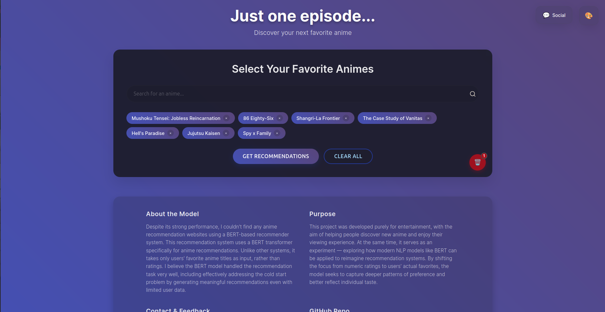
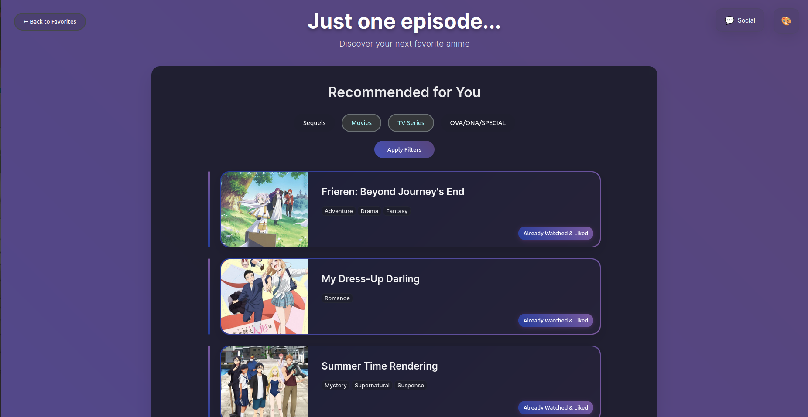

## Web Demo 🌐
https://animerecbertweb-production.up.railway.app/

## Main Code
https://github.com/MRamazan/AnimeRecBERT

## Warning
**main.py script automatically downloads 7 files from my google drive. pretrained model, dataset mappings, anime information files etc.**

## For Linux, Macos
```bash
git clone https://github.com/MRamazan/AnimeRecBertWeb
cd AnimeRecBertWeb
python3 -m venv venv
source venv/bin/activate 
pip install -r requirements.txt
python main.py
```

## For Windows
```bash
git clone https://github.com/MRamazan/AnimeRecBertWeb
cd AnimeRecBertWeb
python -m venv venv
venv\Scripts\activate 
pip install -r requirements.txt
python main.py
```

## Preview



