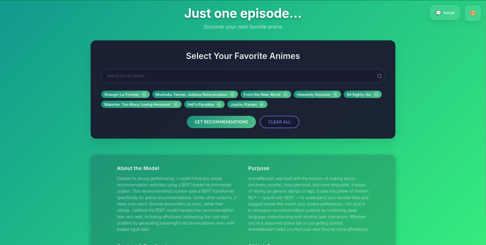
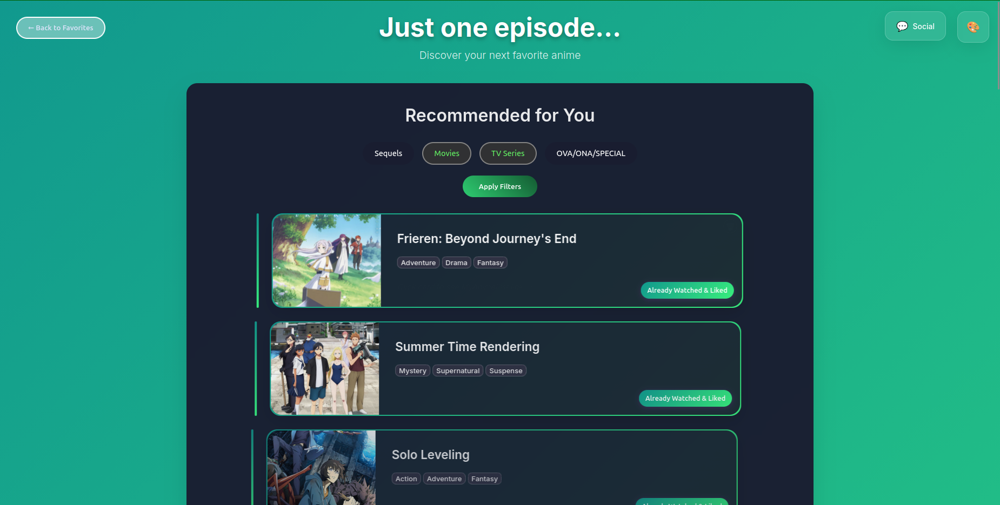
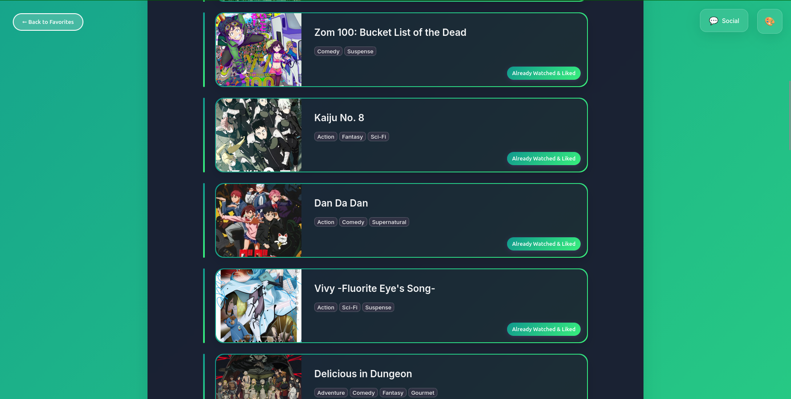
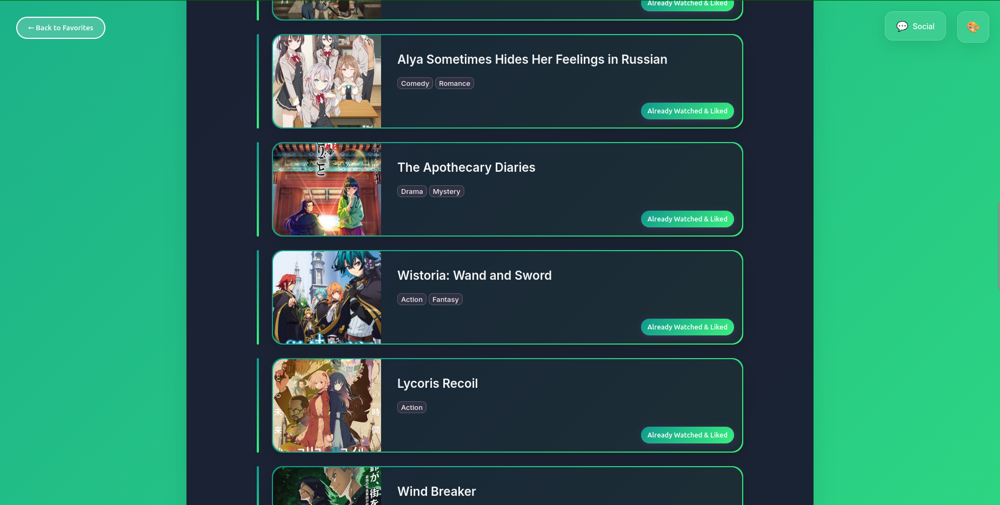

## Web Demo 🌐
www.animerecbert.online

## Main Code
https://github.com/MRamazan/AnimeRecBERT (may be down due to free resource limit)

## For Linux, Macos
If you want to run locally, **main.py script automatically downloads 7 files from my google drive. pretrained model, dataset mappings, anime information files etc.**
```bash
git clone https://github.com/MRamazan/AnimeRecBertWeb
cd AnimeRecBertWeb
python3 -m venv venv
source venv/bin/activate 
pip install -r requirements.txt
python main.py
```

## For Windows
If you want to run locally, **main.py automatically downloads 7 files from my google drive. pretrained model, dataset mappings, anime information files etc.**
```bash
git clone https://github.com/MRamazan/AnimeRecBertWeb
cd AnimeRecBertWeb
python -m venv venv
venv\Scripts\activate 
pip install -r requirements.txt
python main.py
```

## Preview





